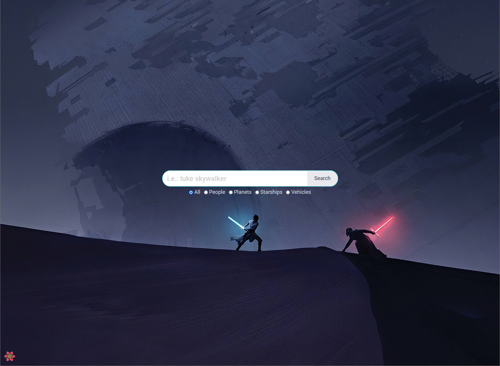
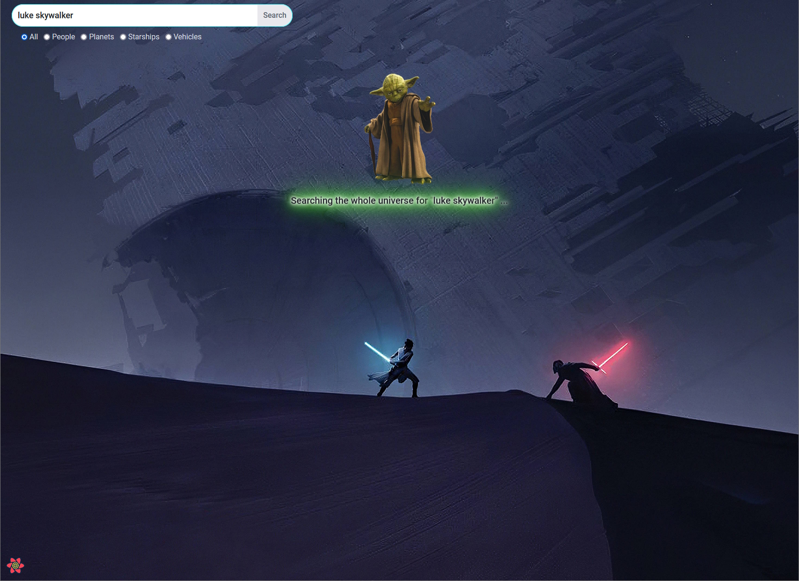
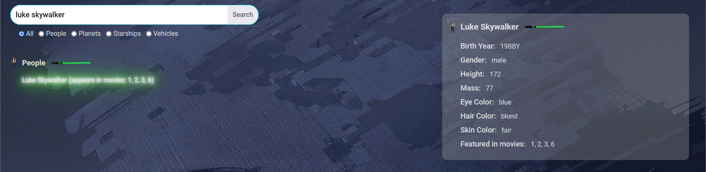
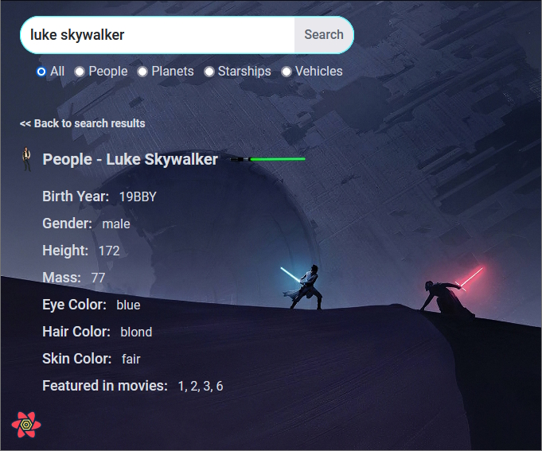

# react-swapi-search-app

React Star Wars API [(SWAPI)](https://swapi.dev/) Search Application

## Proposed Solution

The goal of this assignment is to build a small React application that lets you search and display information from the
Star Wars movies (no knowledge of SW is required). The data needed will be queried
from [SWAPI (Star Wars API)](https://swapi.dev/)
which is an open testing API.

The app should consist of a front page with a centered search box where you can type a search string and get matching
results. Clicking on a result should route to a new page with the search box on top and details about the query
underneath.

## Screenshots

<br/>
<br/>
<br/>


## Application Tech Stack

-   `React` framework (with Typescript) for the overall application development;
-   `SASS` style pre-processor to build the needed application styles;
-   `Axios` to communicate with the backend API;
-   `DotEnv` to load project environment variables;
-   `React-Query` by `TanStack` to retrieve and manage data inside the application;
    performed operation;

## Application Support tools

-   `Prettier` for code formatting;
-   `Webpack` to bundle the application and serve it in development mode;
-   `Log4Brains` to manage Architectural Decision Record (ADR) and generate static HTML knowledge base;
-   `Statoscope` to generate reports about the application;

## Application Testing tools

-   `Jest` javascript testing framework;
-   `React Testing Library` testing framework for working with React components;

## Installation and platform bootstrap

From the project root folder, please execute the following commands in a terminal window:

```
npm i
npm start
```

## Where to go from here (read it "further improvements")

-   The `Search` component could have a dropdown menu with search terms suggestions;
-   The `Search` results page does not have pagination over the results, what could improve the user experience;
-   Apply `useMemo` and / or `useCallback` where needed;
-   Implement a caching system for the result item preview instead of always consulting the API endpoint for data;
